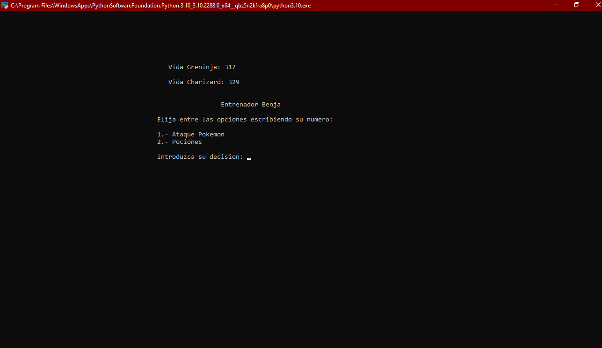
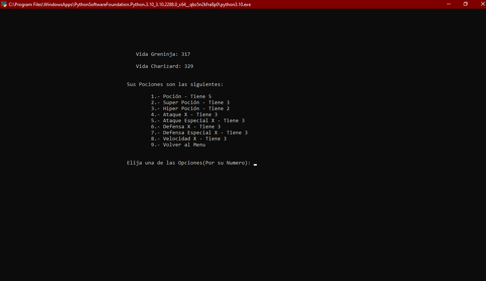

# Combate Pokemon

Este es un proyecto que me propuse antes de comenzar con machin learning y deep learning; ya que eso es a lo que me quiero dedicar, me propuse crear un combate pokemon
por 2 razones, 1 porque me crié viendo pokemon y lo conozco muy bien, 2 porque puede ser un proyecto muy extenso, puede tener distintos tipos de medicinas e items
que den efecto a tu pokemon, skills diferentes a daño las cules provoquen efecto al pokemon oponente, skills que provocan un cambio en el campo de batalla, etc.

Una de las ultimas implementaciones que le quisiera realizar es crear una interfaz grafica como la de pokemon pero diseñada por mi, tambien enves de tener solo clases y
objetos poder conectar con una base de datos la cual tendra todos los pokemons, skills, pociones, etc.

## Version Actual

### 1.2
Esta version lleva la implementaciones de las pociones, hasta el momento solo esta la pocion,
la super pocion y la hiper pocion, aunque estas los objetos de combate que suben los stats base del
pokemon, pero aun no estan al 100% de funcionamiento.
Tambien se cambio un poco la vida del pokemon junto con la potencia de los ataques para volver mas
realista el daño y la vida de los pokemons.

### Implementaciones
      ° Pociones curativas.
      ° Obejtos Modificadores de Stats(50% de funcionalidad real).
      ° Menu electivo de ataque u objetos.
      ° Muestra de vida restante de cada pokemon.

### Imagenes

#### Menu Eleccion

#### Eleccion Pocion

## Versiones Anteriores

### [1.0](Versiones/1.0/)

### [1.1](Versiones/1.1/)

## Proximas Implementaciones
   
### Equipo de 6 pokemons
      - Hasta ahora solo se puede elegir 1 pokemon por entrenador, mas adelante se implementara la opcion de Combate con equipo
        de 6 pokemons por lado o solo 1 pokemon por lado.

      - Se podrá revisar la info de cada pokemon (Skills, Stats, ect).
      
### Base de Datos
      - Esta idea ya es mas a futuro; ya que aun debo estudiar como realizar esto.
      
      - Lo que quiero lograr es que enves de que sean objetos y clases, se pueda acceder a una base de datos
        la cual contendra los pokemons, skills, pociones, etc.
        
      - Quisas existan dos versiones de programa, 1 con clases y objeto, otra con implementacion de DB.

### Interfaz Grafica
      - Al igual que la enteriopr esta sera mas a futuro por temas de estudiar sobre esta area.
      
      - La idea es recrear un poco la interfaz de combate pokemon, pero con toques propios mios.
      
      - Tambien abra una version con interfaz y una con pura terminal, solo para demostrar como cambia una con otra.

