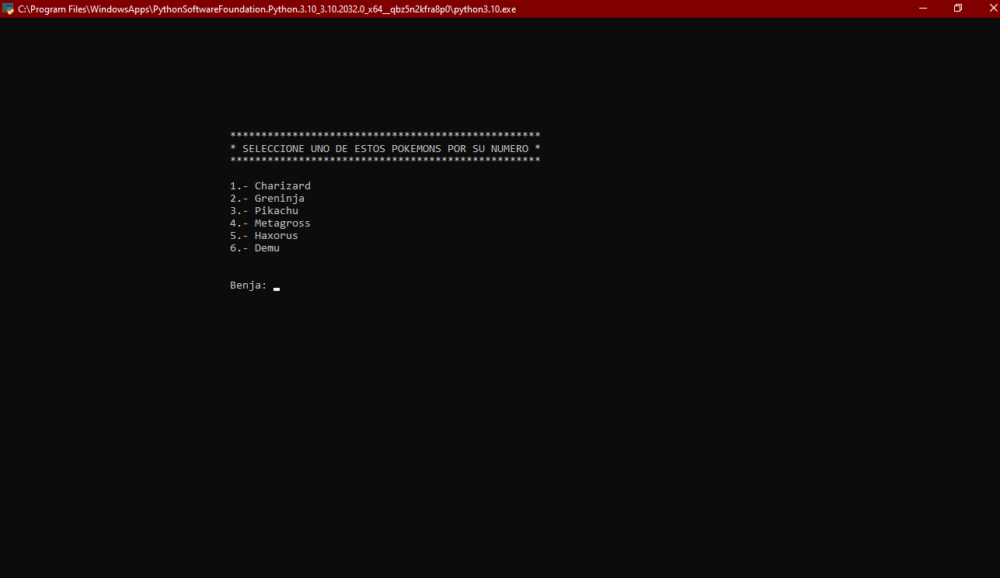
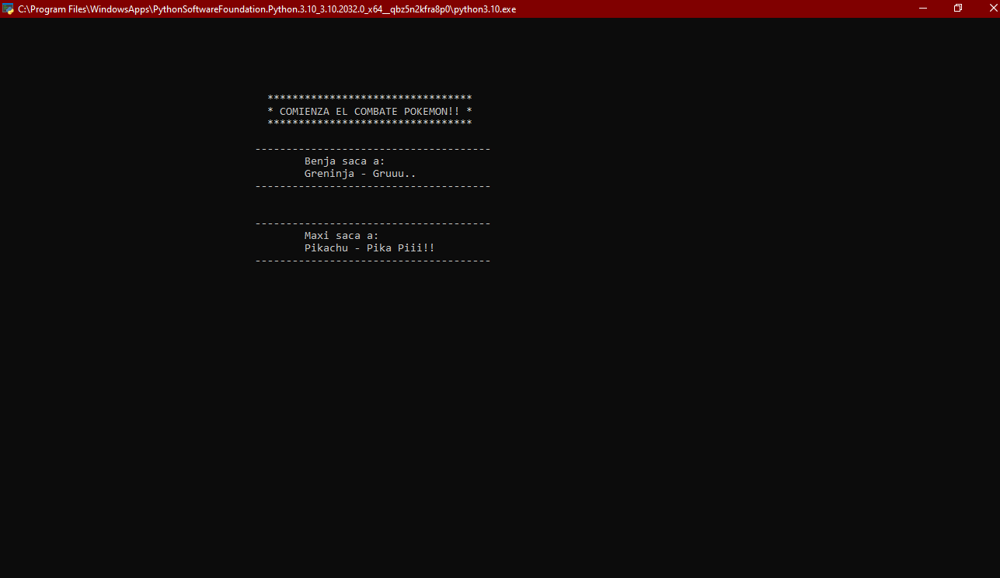
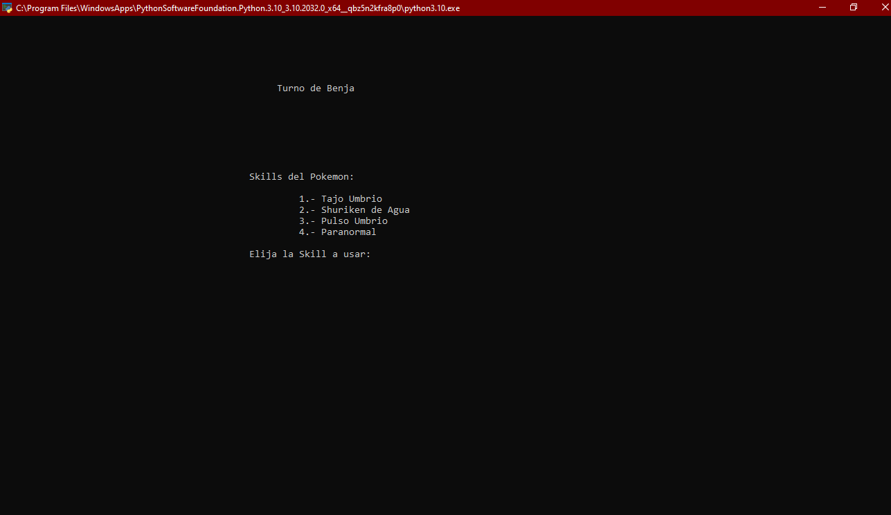
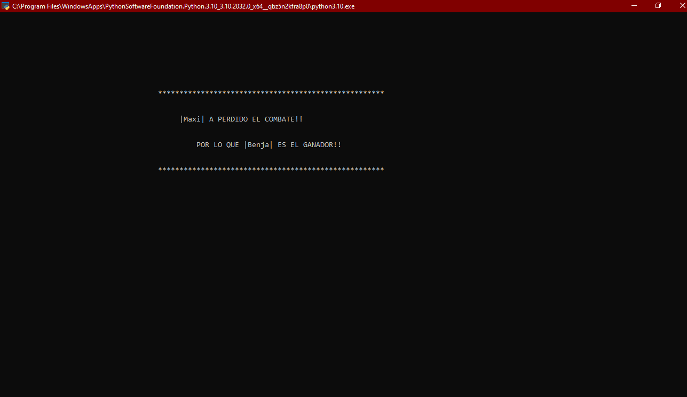

# 1.0
Al ser la version 1.0 solo se puede elegir al pokemon y luego ir atacando al pokemon rival hasta que uno de los dos gane,
su formula de ataque es bastante basica al no tener tantas implementaciones en stats de pokemon, skills y falta de elementos
esenciales para formular un ataque adecuado.

[Link Repositorio](https://github.com/arratiabenjamin/combatePokemon/commit/47ada3d21575ebc37440c487b9cff9c0e0a11fa6)

## Implementaciones
      ° Clase Pokemon.
      ° Clase Skills.
      ° Eleccion de Pokemon y Ataque.
      ° Formula de Ataques Basico.

## Imagenes

### Eleccion Pokemon

### Comienzo de Combate

### Eleccion Skill

### Perdedor y Ganador
