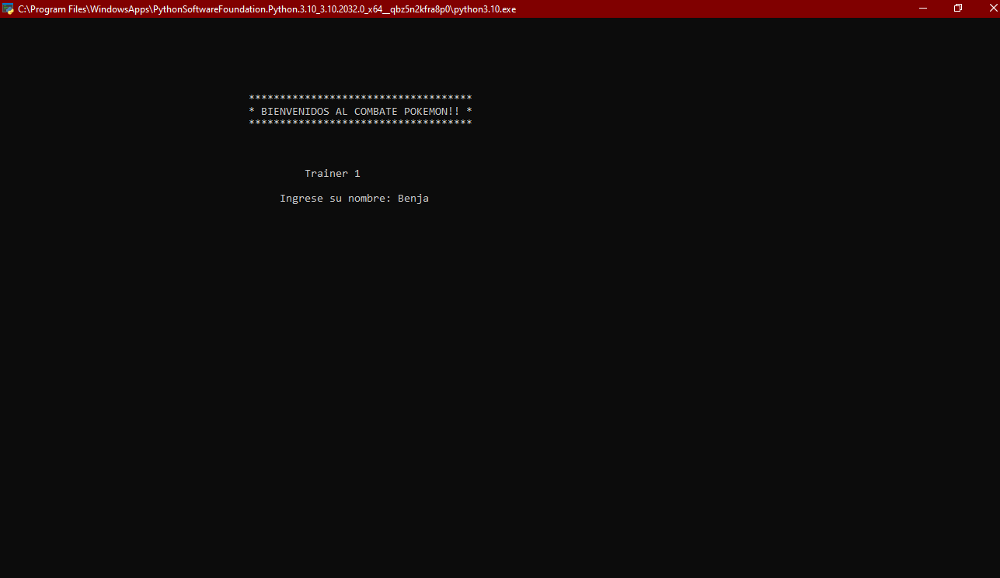
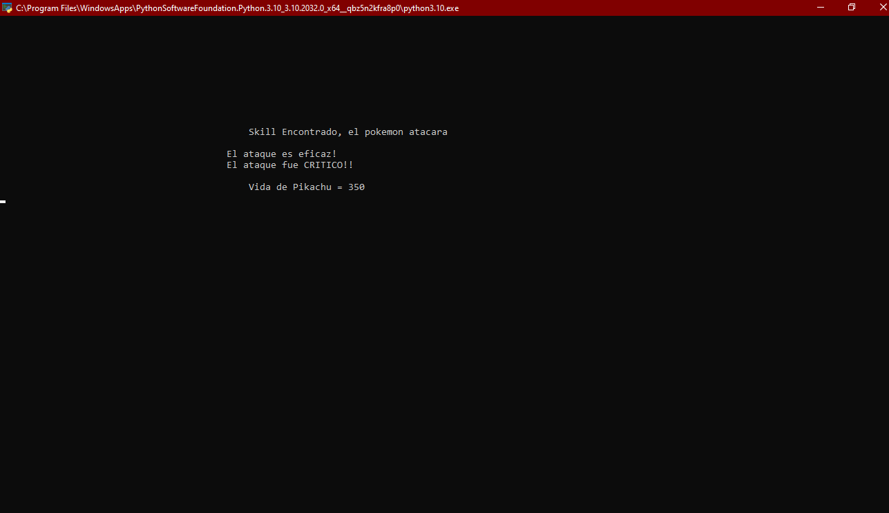

# 1.1
En esta version ya existen los elementos por lo que la formula de ataque es mas avanzada y completa, tambien cuenta con otro factores
importantes como la posibilidad de que el ataque sea critico para ser mas parecida a la del pokemon, ahora cada jugador tendra asignado
su nombre y por ultimo el primer pokemon en atacar sera el con mayor velocidad en stats.

[Link Repositorio](https://github.com/arratiabenjamin/combatePokemon/commit/ac6804db4bbc8c9899f4c97ec385a3796f694fd6)

## Implementaciones
      ° Clase Elements.
      ° Clase Trainer.
      ° Introduccion de Nombres.
      ° Ataca Primero el Pokemon con Mayor Velocidad.
      ° Implementacion de Eficacia en Ataque segun Elemento.
      ° Implementacion de Coincidencia entre Elemento de Skill con algun Elemento del Pokemon Atacante.
      ° Posibilidad de Ataque Critico.
      ° Formula de Ataque Intermedia.

## Imagenes

### Introduccion Nombre

### Eficacia y Critico

